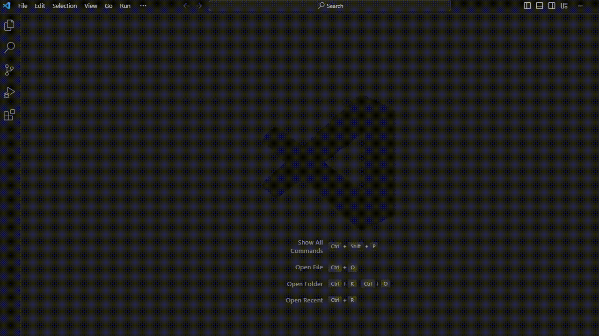

# FolderFly: Quick Folder Access

With this extension, you can effortlessly traverse your folders and swiftly open projects within Visual Studio Code, all without the need to exit the application !

It uses Git to differentiate between genuine projects and regular folders, streamlining your workspace management.

## Features

-   **Efficient Folder Navigation**: Seamlessly navigate through your folders within Visual Studio Code.
-   **Quick Project Access**: Swiftly open your projects without the need to leave the code editor.
-   **Git Integration**: Utilizes Git to distinguish between actual projects and standard folders.
-   **Workspace Management**: Streamlines and organizes your workspace effectively.

## Configuration

**Auto-configuration**:

1. Open the command palette (`Ctrl+Shift+P` on Windows and Linux, `Cmd+Shift+P` on OS X) and search for **FolderFly: Open Folder**.
1. If you haven't configured the extension yet, you'll be presented with two buttons to set it up :
    - **Choose folder**: you will be prompted with the default dialog to select to folder of your choice.
    - **go to settings**: This will direct you to the extension's settings page, where you can proceed with the manual configuration process.
1. Search for **FolderFly: Open Folder**. Now, the command should display the contents of your designated default folder.

**Manuel configuration**:

1. In the VS Code settings page, search for `folderfly.required.folderPath`
1. Copy the absolute path of the folder of your choice.
1. Open the command palette (`Ctrl+Shift+P` on Windows and Linux, `Cmd+Shift+P` on OS X) and search for **FolderFly: Open Folder**.
1. Now, the command should display the contents of your designated default folder.

---

**Tips:**

-   Keep in mind that projects must include a Git folder for the extension to identify it as a valid project.
-   If you'd like to bind the main command to a hotkey, open up your keyboard shortcut settings and bind `folderfly.openFolder` to a custom keybinding.
-   For optimal use of the extension and to minimize manual navigation, it's advisable to centralize all your projects within a single main folder with subfolders, and then direct the extension to this main folder.
